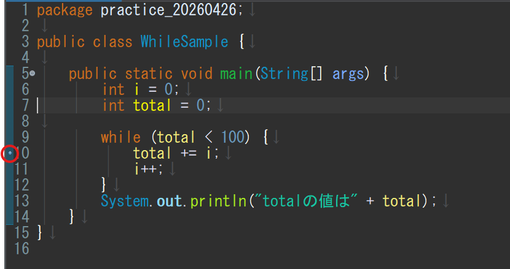

## Javaのコードをトレースするには

Javaのコードについて処理を確認する際に、変数の値の変化をトレースする。
このトレースの方法は複数あるが、今回はEclipseにおけるデバッグモードで確認する方法についてまとめる。

## サンプルコード

`while`文を試すための簡単なJavaクラス。`total`が100以上になるまで`i`を足し続ける処理を観察する。

```java
public class WhileSample {

    public static void main(String[] args) {
        int i = 0;
        int total = 0;

        while (total < 100) {
            total += i;
            i++;
        }
        System.out.println("totalの値は" + total);
    }
}
```

```text
// コンソールの実行結果
totalの値は105
```

このサンプルコードにおける、変数 `total` と `i` をトレースする。

## デバッグモードでの確認手順

### 1. ブレークポイントを置く

トレースする処理の入口にブレークポイントを設定。
今回であれば `total += i;` にブレークポイントを置く。

エディター左端の青い縦帯（垂直マージン / ガッター）をクリックして、緑色の丸（●）が表示されることを確認する。



### 2. デバッグ実行

以下のいずれかでデバッグ起動：

- ツールバーの 🐞（虫アイコン）をクリック
- ショートカット `F11`

### 3. パースペクティブ切り替え

初回起動時、「デバッグ・パースペクティブに切り替えますか?」というダイアログが表示されるので **「はい」** を選択する。

画面レイアウトが切り替わり、左上にデバッグビュー、右上に変数/ブレークポイント/式ビュー、中央にエディター、下にコンソールが表示される。

> 既にデバッグパースペクティブで作業している場合は、右上の「デバッグ」「Java」アイコンで切り替えることもできる。

### 4. 最初の停止位置を確認

プログラムが `total += i;` の行で停止する。エディターの該当行が青くハイライトされているはず（これが「次に実行する行」）。

右上の変数ビューを見ると：

```text
args  = String[0]  (id=...)
i     = 0
total = 0
```

> ⚠️ まだ `total += i;` は実行されていない点に注意。これは「実行直前」の状態。

### 5. F6 で1ステップ実行

`F6`（ステップ・オーバー）を押す。

→ `total += i;` が実行され、次の行 `i++;` に止まる。
→ 変数ビューでは：

```text
i     = 0       ← まだ
total = 0       ← 0 + 0 なので変わらず
```

もう一度 `F6`：

→ `i++;` が実行され、ループ末尾の `}` に到達後、ループ条件 `while (total < 100)` が再評価され、再びブレークポイントの `total += i;` で止まる。
→ 変数：

```text
i     = 1       ← 0+1
total = 0
```

さらに `F6` 連打すると、以下のように値が変化する：

| F6 押下回数 | i | total | 変化 |
|------------|---|-------|------|
| 開始時 | 0 | 0 | 初期値 |
| 2 | 1 | 0 | total += 0 |
| 4 | 2 | 1 | total += 1 |
| 6 | 3 | 3 | total += 2 |
| 8 | 4 | 6 | total += 3 |
| 10 | 5 | 10 | total += 4 |

> 値の変化はオレンジ／黄色でハイライトされる。変数ビューで「直前のステップで変わった変数」が一目でわかる。

### 6. ステップ実行のショートカット一覧

F6 以外にもステップ実行用のキーが用意されている。場面によって使い分ける。

| キー | 名称 | 動作 | 用途 |
|------|------|------|------|
| **F6** | ステップ・オーバー | 次の1行を実行（メソッド呼び出しは中に入らず、まとめて実行） | 主役。ループ内を1行ずつ追う |
| F5 | ステップ・イン | メソッド呼び出しの中に入って1行ずつ実行 | 自作メソッドの内部挙動を追いたい時 |
| F7 | ステップ・リターン | 現在のメソッドを最後まで実行して呼び出し元に戻る | F5で潜りすぎた時の脱出 |
| **F8** | 再開 | 次のブレークポイントまで一気に進める。残っていなければプログラム終了まで走る | ループ序盤を観察したあと結果だけ見たい時 |
| Ctrl+F2 | 強制終了 | デバッグセッションを途中で終了する | やり直したい時 |

普段は **F6**（1行ずつ）と **F8**（一気に進める）を覚えておけば事足りる。F5・F7 は自作メソッドが絡みはじめた段階で使い始めればよい。

複数のブレークポイントを置いたうえで F8 を使うと、「①初期値の確認 → F8 → ②ループ観察 → F8 → ③終了後の値確認」のように、確認したいポイント間を素早く飛び石で移動できる。

### 7. 変数をウォッチする（任意・おすすめ）

毎回変数ビューを目で追うのが煩雑なら、式ビューに登録する：

1. `ウィンドウ → ビューの表示 → 式`（既に表示されていればスキップ）
2. 式ビューの空欄をクリック
3. `total` と入力 → Enter
4. もう一行で `i` を追加
5. さらに `total + i` のような式も書ける（次に `total` に何が入るか先読みできる）

### 8. 条件付きブレークポイント

毎回止めずに「特定の条件のときだけ止める」設定。

1. ブレークポイント（緑●）を**右クリック** → **ブレークポイントのプロパティー...**
2. ダイアログで **条件付き** にチェック
3. 条件式を入力（例：`total > 80`）
4. **OK**

→ プログラムは普通に動き、`total > 80` が true になる時点で初めて停止する。境界条件をピンポイントで観察したい時に便利。

### 9. デバッグ後のブレークポイント解除

確認が終わったら、ブレークポイントを以下のいずれかで処理する：

- **解除（Remove）**：緑●をダブルクリック、または右クリック → ブレークポイントの切り替え
- **無効化（Disable）**：右クリック → ブレークポイントを使用不可にする（位置は残るが効かなくなる、再利用しやすい）
- **全削除**：`ウィンドウ → ビューの表示 → ブレークポイント` でビュー右上の二重×アイコンをクリック

> 通常実行（`Ctrl + F11`）ではブレークポイントは無視されるため、消し忘れても害はない。デバッグ実行時のみ有効。

## まとめ：覚えておきたいこと

- ループの境界条件は **F6 で1ステップずつ追う** のが最速で理解できる
- 普段は **F6（1行進める）と F8（次のブレークポイントへ）** だけで事足りる。F5・F7 はメソッドが絡んだ段階で使い始めればよい
- ブレークポイントはコードに含まれず、通常実行時は無視されるので、消し忘れても害はない
- 条件付きブレークポイントを覚えると、長いループの境界条件観察が一気に楽になる

## 変更履歴

- 2026-04-26: 初版公開
