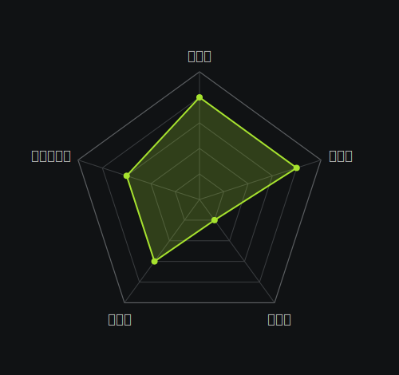

## はじめに

来月から新しい職場に入る。
入社前に、自分が今どういう状態で立っているかを、できるだけ客観的に確認しておきたかった。

直感や「自分はこういうタイプ」という自認が、実態とどれくらいずれているのか。
これは長く気になっていた問いだ。
自認は、本人にとってはほぼ事実扱いになる。
ただし、ふだんの行動や記録と並べてみると、意外な食い違いが出ることもある。

ちょうど過去半年のあいだ、メモ・所感・タスク管理・作業時間・体重などを継続的に記録してきた。
日々の生活ログがほぼすべて手元にある状態だ。
このログを使えば、自認とは独立に、データから自分のパーソナリティの輪郭が出せるはずだと考えた。

集計と解釈の実行はClaude Codeに任せ、対話しながら結果を詰める形にした。
本記事は、その結果を残すためのものだ。

## 使ったデータ

分析対象は半年分のログだ。
内訳は次のとおり。

- Claude Codeとの対話セッションログ(約500ファイル・約4,500件の発話)
- 思考メモ・所感メモ(100件超)
- タスク管理ファイル(数百件のtodo/done)
- 作業時間ログ・体重ログ・筋トレログ

これらをClaude Codeに渡し、3層構造で集計と解釈をまわした。

## 分析の3層構造

集計は3層に分けて整理した。

1. **キーワード層**: メモ全体から特定の語(「自由」「価値」「振り返り」など)の出現回数を集計する
2. **構造化層**: スクリプトでタスクのontime率・ポジネガ語比・作業時間の集中度などを数値化する
3. **内挿層**: 1と2の結果から、Big Five(開放性・誠実性・外向性・協調性・神経症傾向)の5段階自己評価を内挿する

1と2は機械的に集計できる。
3は機械集計だけでは出ないので、Claude Codeに「数値からどの因子がどれくらいに見えるか」を内挿させた。
標準化テストではないので、絶対値ではなく自分の中の相対指標として扱う。

## 結果サマリ

Big Fiveは、性格を5つの因子(開放性・誠実性・外向性・協調性・神経症傾向)で捉える心理学のモデルだ。
今回はその枠組みを借りて、自分のログから5段階で内挿した。

Big Five自己評価(0-5)は次のようになった。

開放性と誠実性が高く、外向性が低い。
協調性と神経症傾向は中位置だ。

数値として印象的だった点も挙げておく。

- 設定した期日の遂行率は約8割
- ポジティブ語とネガティブ語の比はわずかに明るめ寄り
- 一方で自己批判語(「やってしまった」「気づいた」系)は圧倒的に多い
- Claude Codeとの対話は半年で約4,500件、対人発信に類する記述はその数十分の一程度
- 最長で3ヶ月近い「無記録期間」が観測された

外向性の低さは、Claude対話の偏在量と対人発信の少なさから明確に出た。
誠実性の高さは、ontime率と記録運用そのものから推定された。
ポジネガ比と自己批判語の同居は、表層は明るめだが内部で自己採点が走り続けている、という像と整合している。

## 自己像とのズレ

数値を、事前に持っていた自認と突き合わせると、いくつかズレがあった。
ここでは特に印象的だった3点を挙げる。

### 「常に振り返っている」自認 vs 3ヶ月近い無記録期

自分は振り返りを習慣として続けていると思っていた。
実際は波があり、3ヶ月近い無記録期も経験している。
振り返りは「ゼロにしないこと」よりも「再開できること」のほうが、自分の実態に近かった。
途切れる前提で運用を組み直すべき領域だと気づいた。

### 「定量でドライに切る」自認 vs 定性主導の判断

自分はトレードオフを数値で切るタイプだと思っていた。
実際の意思決定メモを見ると、定量的な比較に基づく判断は1割前後しかなく、ほとんどが定性的な比較で決まっていた。
「数字派」を自任していたが、判断のドライバーは感覚寄りだった。
これは弱点というより自分の実装を誤認していたという話で、自覚しておく価値がある。

### 抽象論の不在

具体例への言及量は、抽象論の5倍以上あった。
具体的な状況に降りて考えるのは強みだ。
ただし、自分の言葉で抽象的な原則を語る材料は薄い。
「自分の経験を一般化した教訓」が、思っていたより未形成だった。
他人に説明する場面で、毎回ゼロから例を組み立てる癖の根もここにある。

## 手法の限界

集計と解釈を進めるうちに、いくつかの限界が見えた。

### キーワードの設計

最初に作ったキーワードリストでは、対象の8割以上を取りこぼしていた。
「振り返り」だけでは「後悔」「点検」「見直し」を拾えない。
類義語と否定形を含めて何度かリストを作り直した。
「キーワードで集計する」と言うだけなら簡単だが、設計次第で結果がまるごと変わる。

### 否定形の誤判定

初期スクリプトは「うまくいかない」をポジティブ寄りに判定していた。
否定形を一律で逆転させるルールに直すまで、ポジネガ比は使い物にならなかった。
表面的な語感ベースの集計には、こうした初歩的な穴が常にある。

### 自己参照ノイズ

「振り返りの定義」を説明しているメモが、「振り返り行動」としてカウントされる現象もあった。
語の出現と、その語が指す行動の発生は別物だ。
メタ言及を弾く前処理を入れないと、自己分析を題材にしたメモほど自己分析の数値を膨らませる、という妙な歪みが出る。

### AIによる解釈の拡張

AIに集計結果の解釈を任せると、文脈を勝手に補完して、もっともらしいが事実と違う物語を作ることがある。
今回も、次の所属の業務形態について、AIが過去のセッション情報と混同し、誤った前提で解釈を組み立てる事故が起きた。
気づけたのは、自分が当事者で、その物語に違和感を持てたからだ。
集計はAIに任せられても、解釈の最終確認は本人が引き受ける必要がある。

## おわりに

入社前に確認しておきたかった「自分の現在地」は、これでひとまず取れた。
分析は今回で一区切りだ。
半年分のログという限定された素材で、決定的な答えが出るわけではない。
この記事は、現在地のスナップショットとして残しておく。

自分のメモとClaude Codeで、ここまで自分の輪郭がデータから出せるとは思っていなかった。
やってみて、率直に面白かった。
